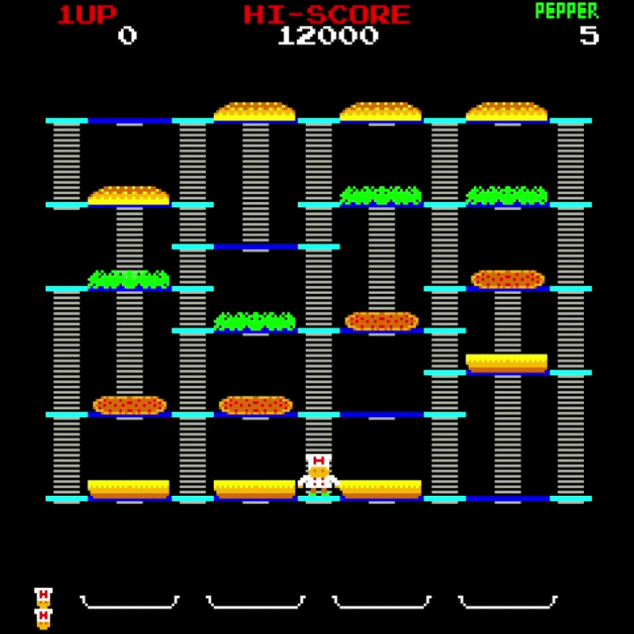

# 🍔 Minigin Engine — Burger Time
 
A custom 2D game engine written in modern C++, built on top of the [Minigin](https://github.com/avadae/minigin) starter project, together with a recreation of the 1982 Data East arcade classic **Burger Time** as a showcase game.
 
This project was developed for the **Programming 4** course at Howest — Digital Arts and Entertainment (DAE). The objective was:
 
1. Design and implement a small, reusable 2D game engine.
2. Build a full retro arcade game on top of that engine to prove it works in practice.

 
## Gameplay
 
You play as **Peter Pepper**, a chef trying to assemble giant burgers by walking across their ingredients. Each step you take on a bun, lettuce, patty, or top causes that piece to fall one level down — and if it lands on enemies, even better.
 
You're chased by:
- 🌭 **Mr. Hot Dog**
- 🥚 **Mr. Egg**
- 🥒 **Mr. Pickle**
  
Your only defence is a limited supply of **pepper shakes**, which briefly stun nearby enemies. Drop all the burger ingredients to the plates at the bottom to complete each level.
 
## 📸 Demo

## ⚙️ Engine Features
 
The Minigin engine provides the foundation the game is built on:
 
- **GameObject / Component system** — composition over inheritance, every entity is built from reusable components (transform, render, collider, animator, etc.)
- **Scene management** — multiple scenes with smooth transitions (main menu, gameplay, game over, high scores)
- **Resource Manager** — centralized loading and caching of textures, fonts, and audio
- **Rendering** — 2D sprite rendering, animated sprites, text rendering, debug rendering
- **Input Manager** — keyboard and Xbox controller (XInput) support, with rebindable commands
- **Audio system** — multi-channel sound effects and music, running on a dedicated thread so audio never blocks the game loop
- **Event / Observer system** — decoupled communication between gameplay systems (score, lives, achievements)
- **Collision detection** — AABB collisions for player, enemies, and ingredients
- **Level loading** — data-driven level layouts loaded from external files
- **ImGui integration** — in-engine debug overlays
- **Steam-style achievements** — unlocked through observer events (e.g. *“Just started”*, *“Unbeetable”*, *“Serve a whole burger”*)

 
## Design Patterns Used
 
The engine is structured around several classic game programming patterns:
 
| Pattern | Used For |
|---|---|
| **Component** | Building GameObjects out of reusable behaviors |
| **Singleton** | Managers (Scene, Resource, Input, Renderer, Time) |
| **Observer** | Score updates, life lost, achievements, UI refresh |
| **Command** | Input binding — every keyboard/controller action maps to a command |
| **State** | Character states (walking, climbing, dying), enemy AI |
| **Service Locator** | Swapping the real audio service for a null/logging version |
| **Update Method** | Per-frame updates on every GameObject and Component |
| **Game Loop** | Fixed-update physics + variable-update rendering |
 
 
## Tech Stack
 
- **Language:** C++20
- **Platform:** Windows (x64)
- **IDE:** Visual Studio 2022
- **Graphics / Windowing:** [SDL2](https://www.libsdl.org/)
- **Image loading:** SDL2_image
- **Fonts:** SDL2_ttf
- **Audio:** SDL2_mixer
- **Math:** [GLM](https://github.com/g-truc/glm)
- **Debug UI:** [Dear ImGui](https://github.com/ocornut/imgui)
- **Memory leak detection:** Visual Leak Detector (VLD)
- **Input:** XInput (Xbox controllers)

- ## 🎛 Controls
 
### Keyboard (Player 1)
| Action | Key |
|---|---|
| Move | `W` `A` `S` `D` |
| Throw pepper | `Space` |
| Confirm (Menu) | `Enter` |
| Quit | `Esc` |
 
### Xbox Controller
| Action | Button |
|---|---|
| Move | Left stick / D-pad |
| Throw pepper | `A` |
| Back (Menu) | `B` |

### Debug Commands
 
Global debug shortcuts
 
| Action | Key |
|---|---|
| Skip current level | `F1` |
| Mute / unmute audio | `F2` |

## Credits
 
- **Engine & Game:** Revekka Andronikidu
- **Starter project:** [Minigin](https://github.com/avadae/minigin) by Alex Vanden Abeele (DAE)
- **Reading material:** *Game Programming Patterns* — Robert Nystrom
- **Original game:** *Burger Time* — Data East, 1982
- All trademarks and assets belong to their respective owners. This project is a non-commercial educational recreation.
 
## License
This project was made as part of the DAE Programming 4 course.
